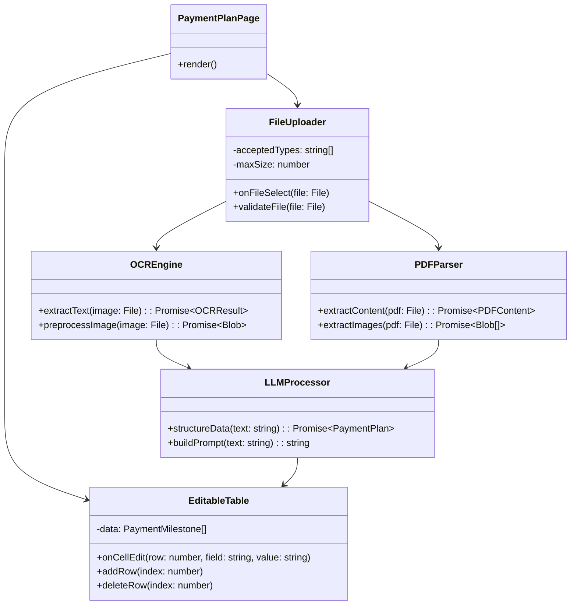
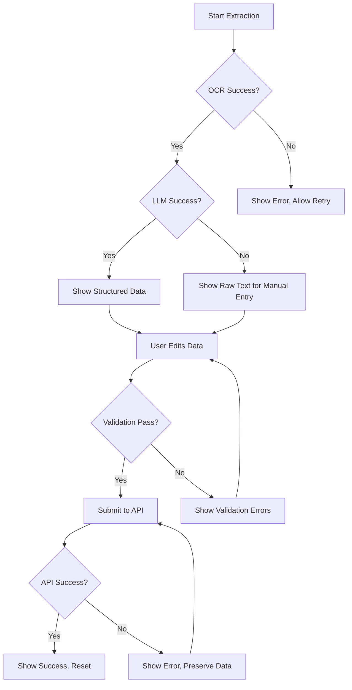

# Design Document: Payment Plan Extractor

## Overview

The Payment Plan Extractor is a self-contained feature within the `app/payment-plan/` directory that enables users to upload payment plan documents (images or PDFs), extract structured data using OCR and LLM processing, review/edit the data in a table, and submit it to an API endpoint.

The system follows a pipeline architecture:
1. **File Upload** → Accept and validate files
2. **Text Extraction** → OCR for images, pdf.js for PDFs
3. **Data Structuring** → LLM processes raw text into structured JSON
4. **User Review** → Editable table for corrections
5. **Submission** → Send validated data to API

### Technology Stack
- **OCR**: Tesseract.js (free, browser-based)
- **PDF Parsing**: pdf.js (free, Mozilla)
- **LLM**: Groq free tier (llama-3.1-8b-instant) or Ollama local
- **UI**: shadcn/ui components
- **State Management**: React useState/useReducer

## Architecture

```mermaid
flowchart TB
    subgraph UI["UI Layer"]
        Upload[FileUploader]
        Preview[FilePreview]
        Table[EditableTable]
        Actions[ActionButtons]
    end

    subgraph Processing["Processing Layer"]
        OCR[OCREngine]
        PDF[PDFParser]
        LLM[LLMProcessor]
    end

    subgraph API["API Layer"]
        Route[/api/payment-plan/extract]
        Submit[/api/payment-plan/submit]
    end

    Upload --> |Image| OCR
    Upload --> |PDF| PDF
    PDF --> |Images| OCR
    PDF --> |Text| LLM
    OCR --> |Raw Text| LLM
    LLM --> |Structured Data| Table
    Table --> |Confirmed Data| Submit
    
    Route --> OCR
    Route --> PDF
    Route --> LLM
```

### Component Architecture



## Components and Interfaces

### File Structure

```
app/payment-plan/
├── page.tsx                    # Main page component
├── components/
│   ├── file-uploader.tsx       # Drag-drop file upload
│   ├── file-preview.tsx        # Preview uploaded file
│   ├── editable-table.tsx      # Editable data table
│   ├── extraction-progress.tsx # Loading/progress indicator
│   └── action-buttons.tsx      # Confirm/Reset buttons
├── lib/
│   ├── ocr-engine.ts           # Tesseract.js wrapper
│   ├── pdf-parser.ts           # pdf.js wrapper
│   ├── llm-processor.ts        # LLM API client
│   ├── image-preprocessor.ts   # Image enhancement
│   └── validators.ts           # Data validation
├── types/
│   └── index.ts                # TypeScript interfaces
├── hooks/
│   ├── use-extraction.ts       # Extraction state management
│   └── use-payment-plan.ts     # Payment plan state
├── api/
│   └── extract/
│       └── route.ts            # Server-side extraction API
└── examples/                   # Example images (existing)
```

### Core Interfaces

```typescript
// types/index.ts

interface PaymentMilestone {
  id: string;
  milestone: string;
  percentage: number | null;
  amount: number | null;
  dueDate: string | null;
  notes: string | null;
}

interface PaymentPlan {
  milestones: PaymentMilestone[];
  totalPercentage: number;
  currency: string | null;
  projectName: string | null;
  rawText: string;
}

interface ExtractionResult {
  success: boolean;
  data: PaymentPlan | null;
  error: string | null;
  confidence: number;
}

interface OCRResult {
  text: string;
  confidence: number;
  blocks: TextBlock[];
}

interface TextBlock {
  text: string;
  bbox: BoundingBox;
  confidence: number;
}

interface BoundingBox {
  x: number;
  y: number;
  width: number;
  height: number;
}

interface PDFContent {
  text: string;
  pages: number;
  images: Blob[];
}

interface FileValidation {
  valid: boolean;
  error: string | null;
}

interface ExtractionState {
  status: 'idle' | 'uploading' | 'extracting' | 'structuring' | 'complete' | 'error';
  progress: number;
  message: string;
}

interface SubmissionPayload {
  paymentPlan: PaymentPlan;
  originalFileName: string;
  extractedAt: string;
}
```

### Component Interfaces

```typescript
// FileUploader Props
interface FileUploaderProps {
  onFileSelect: (file: File) => void;
  acceptedTypes: string[];
  maxSizeMB: number;
  disabled?: boolean;
}

// EditableTable Props
interface EditableTableProps {
  data: PaymentMilestone[];
  onDataChange: (data: PaymentMilestone[]) => void;
  onAddRow: (index: number) => void;
  onDeleteRow: (index: number) => void;
}

// ExtractionProgress Props
interface ExtractionProgressProps {
  state: ExtractionState;
}

// ActionButtons Props
interface ActionButtonsProps {
  onConfirm: () => void;
  onReset: () => void;
  disabled: boolean;
  isSubmitting: boolean;
}
```

## Data Models

### Payment Plan Schema

```typescript
const PaymentMilestoneSchema = z.object({
  id: z.string().uuid(),
  milestone: z.string().min(1, "Milestone name is required"),
  percentage: z.number().min(0).max(100).nullable(),
  amount: z.number().min(0).nullable(),
  dueDate: z.string().nullable(),
  notes: z.string().nullable(),
});

const PaymentPlanSchema = z.object({
  milestones: z.array(PaymentMilestoneSchema).min(1),
  totalPercentage: z.number(),
  currency: z.string().nullable(),
  projectName: z.string().nullable(),
  rawText: z.string(),
});
```

### LLM Prompt Template

```typescript
const EXTRACTION_PROMPT = `
You are a payment plan data extractor for real estate properties.
Extract payment milestones from the following text.

Common milestone types:
- Booking/Reservation
- Down Payment
- During Construction (with percentages)
- On Completion/Handover
- Post-Handover Installments

For each milestone, extract:
- milestone: Name/description
- percentage: Payment percentage (number only, no %)
- amount: Payment amount (number only, no currency)
- dueDate: Due date if mentioned
- notes: Any additional notes

Return JSON format:
{
  "milestones": [...],
  "currency": "AED" or detected currency,
  "projectName": "detected project name or null"
}

Text to extract from:
{rawText}
`;
```

### State Management

```typescript
// Extraction state reducer
type ExtractionAction =
  | { type: 'START_UPLOAD' }
  | { type: 'START_EXTRACTION' }
  | { type: 'UPDATE_PROGRESS'; progress: number; message: string }
  | { type: 'START_STRUCTURING' }
  | { type: 'COMPLETE'; data: PaymentPlan }
  | { type: 'ERROR'; error: string }
  | { type: 'RESET' };

function extractionReducer(
  state: ExtractionState,
  action: ExtractionAction
): ExtractionState {
  switch (action.type) {
    case 'START_UPLOAD':
      return { status: 'uploading', progress: 0, message: 'Uploading file...' };
    case 'START_EXTRACTION':
      return { status: 'extracting', progress: 0, message: 'Extracting text...' };
    case 'UPDATE_PROGRESS':
      return { ...state, progress: action.progress, message: action.message };
    case 'START_STRUCTURING':
      return { status: 'structuring', progress: 80, message: 'Structuring data...' };
    case 'COMPLETE':
      return { status: 'complete', progress: 100, message: 'Extraction complete' };
    case 'ERROR':
      return { status: 'error', progress: 0, message: action.error };
    case 'RESET':
      return { status: 'idle', progress: 0, message: '' };
    default:
      return state;
  }
}
```

### API Request/Response

```typescript
// POST /api/payment-plan/extract
interface ExtractRequest {
  file: File; // FormData
}

interface ExtractResponse {
  success: boolean;
  data: PaymentPlan | null;
  error: string | null;
}

// POST /api/payment-plan/submit
interface SubmitRequest {
  paymentPlan: PaymentPlan;
  originalFileName: string;
}

interface SubmitResponse {
  success: boolean;
  id: string | null;
  error: string | null;
}
```


## Correctness Properties

*A property is a characteristic or behavior that should hold true across all valid executions of a system—essentially, a formal statement about what the system should do. Properties serve as the bridge between human-readable specifications and machine-verifiable correctness guarantees.*

### Property 1: File Type Validation

*For any* file uploaded to the File_Uploader, the file SHALL be accepted if and only if its extension is PNG, JPG, JPEG, or PDF (case-insensitive). All other file types SHALL be rejected with an error message.

**Validates: Requirements 1.2, 1.3**

### Property 2: File Size Validation

*For any* file uploaded to the File_Uploader, if the file size exceeds 10MB, the file SHALL be rejected with a size limit error. Files at or below 10MB SHALL be accepted (assuming valid type).

**Validates: Requirements 1.5**

### Property 3: OCR Result Structure

*For any* image processed by the OCR_Engine, the returned OCRResult SHALL contain: a non-null text string, a confidence score between 0 and 1, and an array of TextBlock objects each with text, bounding box coordinates, and confidence.

**Validates: Requirements 2.3**

### Property 4: PDF Page Processing

*For any* PDF with N pages processed by the PDF_Parser, the extracted text SHALL contain content from all N pages. The page count in the result SHALL equal the actual page count of the PDF.

**Validates: Requirements 3.3**

### Property 5: LLM Output Structure

*For any* text processed by the LLM_Processor, the returned PaymentPlan SHALL contain: an array of PaymentMilestone objects where each milestone has an id, milestone name, and nullable percentage/amount/dueDate/notes fields.

**Validates: Requirements 4.2**

### Property 6: Table Row Addition

*For any* editable table with N rows, when a user adds a row at index I (where 0 ≤ I ≤ N), the resulting table SHALL have N+1 rows, and the new empty row SHALL be at index I.

**Validates: Requirements 5.4**

### Property 7: Table Row Deletion

*For any* editable table with N rows (N > 0), when a user deletes the row at index I (where 0 ≤ I < N), the resulting table SHALL have N-1 rows, and the row that was at index I SHALL no longer exist.

**Validates: Requirements 5.5**

### Property 8: Percentage Sum Validation

*For any* set of PaymentMilestone objects in the Data_Table, if the sum of all non-null percentage values does not equal 100, a warning SHALL be displayed. If the sum equals 100, no warning SHALL be displayed.

**Validates: Requirements 5.6**

### Property 9: Submission Validation

*For any* submission attempt, if any milestone has an empty milestone name, the submission SHALL be rejected with a validation error. Only when all required fields are filled SHALL the submission proceed to the API call.

**Validates: Requirements 6.1, 6.2**

### Property 10: Submission Payload Completeness

*For any* successful submission to the API, the payload SHALL include: the complete PaymentPlan object, the original file name, and an extractedAt timestamp.

**Validates: Requirements 6.5**

### Property 11: Layout Detection Robustness

*For any* image containing payment plan data (structured table, unstructured text, or timeline layout), the extraction pipeline SHALL produce a PaymentPlan with at least one milestone, regardless of the source layout format.

**Validates: Requirements 9.1, 9.2, 9.3**

## Error Handling

### File Upload Errors

| Error Condition | User Message | Recovery Action |
|----------------|--------------|-----------------|
| Unsupported file type | "Please upload a PNG, JPG, or PDF file" | Allow retry with different file |
| File too large | "File size exceeds 10MB limit" | Allow retry with smaller file |
| File read error | "Unable to read file. Please try again" | Allow retry |

### OCR Errors

| Error Condition | User Message | Recovery Action |
|----------------|--------------|-----------------|
| Tesseract initialization failed | "OCR engine failed to initialize" | Retry or refresh page |
| Image processing failed | "Unable to process image" | Allow retry with different image |
| Low confidence extraction | "Low confidence extraction. Please review carefully" | Show results with warning |

### PDF Parsing Errors

| Error Condition | User Message | Recovery Action |
|----------------|--------------|-----------------|
| Corrupted PDF | "PDF file appears to be corrupted" | Allow retry with different file |
| Password protected | "Password-protected PDFs are not supported" | Allow retry with unprotected file |
| No extractable content | "No text or images found in PDF" | Allow retry with different file |

### LLM Processing Errors

| Error Condition | User Message | Recovery Action |
|----------------|--------------|-----------------|
| API unavailable | "AI service temporarily unavailable" | Show raw text for manual entry |
| Rate limit exceeded | "Too many requests. Please wait and retry" | Auto-retry after delay |
| Invalid response | "Unable to structure data automatically" | Show raw text for manual entry |
| Timeout | "Processing took too long" | Allow retry or manual entry |

### Submission Errors

| Error Condition | User Message | Recovery Action |
|----------------|--------------|-----------------|
| Validation failed | "Please fill in all required fields" | Highlight missing fields |
| Network error | "Network error. Please check connection" | Allow retry, preserve data |
| API error | "Server error: {message}" | Allow retry, preserve data |

### Graceful Degradation Strategy



## Testing Strategy

### Dual Testing Approach

This feature requires both unit tests and property-based tests for comprehensive coverage:

- **Unit tests**: Verify specific examples, edge cases, UI interactions, and error conditions
- **Property tests**: Verify universal properties across randomly generated inputs

### Property-Based Testing Configuration

- **Library**: fast-check (TypeScript property-based testing)
- **Minimum iterations**: 100 per property test
- **Tag format**: `Feature: payment-plan-extractor, Property {N}: {property_text}`

### Unit Test Coverage

| Component | Test Focus |
|-----------|------------|
| FileUploader | File type validation, size validation, drag-drop behavior |
| OCREngine | Tesseract initialization, image preprocessing |
| PDFParser | Text extraction, image extraction, multi-page handling |
| LLMProcessor | Prompt construction, response parsing, error handling |
| EditableTable | Cell editing, row add/delete, percentage validation |
| Validators | Schema validation, required field checks |

### Property Test Coverage

| Property | Generator Strategy |
|----------|-------------------|
| Property 1 | Generate random file names with various extensions |
| Property 2 | Generate files with random sizes (0 to 50MB) |
| Property 3 | Generate mock OCR results and verify structure |
| Property 4 | Generate mock PDFs with 1-10 pages |
| Property 5 | Generate random text inputs, verify output structure |
| Property 6 | Generate tables with 0-20 rows, random insert positions |
| Property 7 | Generate tables with 1-20 rows, random delete positions |
| Property 8 | Generate milestone arrays with random percentages |
| Property 9 | Generate milestone arrays with random field completeness |
| Property 10 | Generate submission payloads, verify completeness |
| Property 11 | Use example images to verify extraction produces results |

### Integration Test Scenarios

1. **Happy Path**: Upload image → Extract → Edit → Submit
2. **PDF Flow**: Upload PDF → Extract text + images → Structure → Submit
3. **Manual Entry Fallback**: Upload → OCR fails → Manual entry → Submit
4. **Edit Heavy Flow**: Upload → Extract → Multiple edits → Validate → Submit
5. **Error Recovery**: Upload → API error → Retry → Success

### Test File Organization

```
app/payment-plan/
├── __tests__/
│   ├── file-uploader.test.tsx
│   ├── editable-table.test.tsx
│   ├── ocr-engine.test.ts
│   ├── pdf-parser.test.ts
│   ├── llm-processor.test.ts
│   ├── validators.test.ts
│   └── properties/
│       ├── file-validation.property.ts
│       ├── table-operations.property.ts
│       ├── data-structure.property.ts
│       └── submission.property.ts
```
